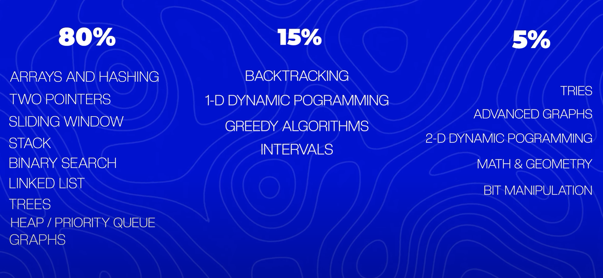

# Interview Question Prep



## 80% Arrays & Hashing, Two Pointers, Sliding Window, Stack, Binary Search, Linked List, Trees, Heap / Priority Queue, Graphs

| Problem                                                                                                              | Difficulty | Tags                  | Date       | Date Revisited | Notable Code                                                                                                                                                                                                                                                                                       | Notes on Revisit                                                                                              |
|----------------------------------------------------------------------------------------------------------------------|------------|-----------------------|------------|----------------|----------------------------------------------------------------------------------------------------------------------------------------------------------------------------------------------------------------------------------------------------------------------------------------------------|---------------------------------------------------------------------------------------------------------------|
| [Contains Duplicate](https://neetcode.io/problems/duplicate-integer)                                                 | Easy       | Arrays, Hashing       | 2025-04-21 | 2025-04-24     | ``` Set<Integer> seen = new HashSet<>() seen.contains(num), seen.add(num) ```                                                                                                                                                                                                                      | confident                                                                                                     |
| [Valid Anagram](https://neetcode.io/problems/is-anagram)                                                             | Easy       | Arrays, Hashing       | 2025-04-21 | 2025-04-24     | ``` HashMap<Character, Integer> countS = new HashMap<>(), countS.put(s.charAt(i), countS.getOrDefault(s.charAt(i), 0) + 1) ```                                                                                                                                                                     | getOrDefault  ... i just used get and that doesn't work                                                       |
| [Two Sum](https://neetcode.io/problems/two-integer-sum)                                                              | Easy       | Arrays, Hashing       | 2025-04-21 | 2025-04-24     | ``` HashMap<Integer, Integer> map = new HashMap<>(), map.containsKey(target - nums[i]), return new int[] { map.get(target - nums[i]), i }, map.put(nums[i], i) ```                                                                                                                                 | confident ... HashMap<Integer, Integer> the first integer is the nums[index] and second is the index          |
| [Valid Palindrome](https://neetcode.io/problems/is-palindrome)                                                       | Easy       | Two Pointers          | 2025-04-21 | 2025-04-25     | ``` (c >= 'A' && c <= 'Z' or c >= 'a' && c <= 'z' or c >= '0' && c <= '9'), while (left < right), (left < right && !alphaNum(s.charAt(left)), (right > left && !alphaNum(s.charAt(right)), Character.toLowerCase(s.charAt(left)) != Character.toLowerCase(s.charAt(right)), left++, right-- ```    | confident ... toLowerCase and it's just l < r or r > l because the character where they meet doesn't matter ! |
| [Best Time to Buy and Sell Stock](https://neetcode.io/problems/buy-and-sell-crypto)                                  | Easy       | Sliding Window        | 2025-04-21 | 2025-04-25     | ``` int maxProfit = 0; int minBuy = prices[0]; for (int sell : prices) { maxProfit = Math.max(maxProfit, sell - minBuy); minBuy = Math.min(minBuy, sell); } return maxProfit; ```                                                                                                                  | kinda confident... buy = sell if prices[sell] < prices[buy]!                                                  |
| [Valid Parentheses](https://neetcode.io/problems/validate-parentheses)                                               | Easy       | Stack                 | 2025-04-21 |                | ``` Stack<Character> stack = new Stack<>(), Map<Character, Character> closeToOpen = new HashMap<>(), closeToOpen.put(')', '('), !closeToOpen.containsKey(c), stack.push(c), !stack.isEmpty() && stack.peek() == closeToOpen.get(c), stack.pop() ```                                                |                                                                                                               |
| [Binary Search](https://neetcode.io/problems/binary-search)                                                          | Easy       | Binary Search         | 2025-04-22 |                | ``` int l = 0, r = nums.length - 1,  int m = l + ((r - l) / 2), r = m - 1```                                                                                                                                                                                                                       |                                                                                                               |
| [Reverse Linked List](https://neetcode.io/problems/reverse-a-linked-list)                                            | Easy       | Linked List           | 2025-04-22 |                | ``` ListNode prev = null, curr = head, next; while (curr != null) { next = curr.next; curr.next = prev; prev = curr; curr = next; } return prev; ```                                                                                                                                               |                                                                                                               |
| [Merge Two Sorted Lists](https://neetcode.io/problems/merge-two-sorted-linked-lists)                                 | Easy       | Linked List           | 2025-04-22 |                | ```  ```                                                                                                                                                                                                                                                                                           |                                                                                                               |
| [Linked List Cycle](https://neetcode.io/problems/linked-list-cycle-detection)                                        | Easy       | Linked List           | 2025-04-22 |                | ``` ListNode slow = head, fast = head; while (fast != null && fast.next != null) { slow = slow.next; fast = fast.next.next; if (slow == fast) return true; } return false; ```                                                                                                                     |                                                                                                               |
| [Invert Binary Tree](https://neetcode.io/problems/invert-a-binary-tree)                                              | Easy       | Trees                 | 2025-04-23 |                | ``` if (root == null) return null; TreeNode temp = root.left; root.left = root.right; root.right = temp; invertTree(root.left); invertTree(root.right); return root; ```                                                                                                                           |                                                                                                               |
| [Maximum Depth of Binary Tree](https://neetcode.io/problems/depth-of-binary-tree)                                    | Easy       | Trees                 | 2025-04-23 |                | ``` if (root == null) return 0; return Math.max(maxDepth(root.left), maxDepth(root.right)) + 1; ``` literally wtf to the other ways                                                                                                                                                                |                                                                                                               |
| [Diameter of Binary Tree](https://neetcode.io/problems/binary-tree-diameter)                                         | Easy       | Trees                 | 2025-04-24 |                | ``` int[] res = new int[1]; dfs(root, res); return res[0]; res[0] = Math.max(res[0], left + right); return 1 + Math.max(left, right); ``` literally wtf                                                                                                                                            |                                                                                                               |
| [Balanced Binary Tree](https://neetcode.io/problems/balanced-binary-tree)                                            | Easy       | Trees                 | 2025-04-24 |                | ``` return dfs(root)[0] == 1;  return new int[]{1, 0}; boolean balanced = (left[0] == 1 && right[0] == 1) && (Math.abs(left[1] - right[1]) <= 1); int height = 1 + Math.max(left[1], right[1]); return new int[]{balanced ? 1 : 0, height};```                                                     |                                                                                                               |
| [Same Binary Tree](https://neetcode.io/problems/same-binary-tree)                                                    | Easy       | Trees                 | 2025-04-24 |                | ``` if (p == null && q == null)  if (p != null && q != null && p.val == q.val) return isSameTree(p.left, q.left) && isSameTree(p.right, q.right);``` makes sense finally                                                                                                                           |                                                                                                               |
| [Subtree of Another Tree](https://neetcode.io/problems/subtree-of-a-binary-tree)                                     | Easy       | Trees                 | 2025-04-24 |                | ``` if (root == null) return false; if (isSameTree(root, subRoot)) return true; return isSubtree(root.left, subRoot) ``` crazy stuff here wtf                                                                                                                                                      |                                                                                                               |
| [Kth Largest Element in an Stream](https://neetcode.io/problems/kth-largest-integer-in-a-stream)                     | Easy       | Heap / Priority Queue | 2025-04-24 |                | ```  minHeap.offer(num); if (minHeap.size() > k) minHeap.poll(); ``` i like this one                                                                                                                                                                                                               |                                                                                                               |
| [Last Stone Weight](https://neetcode.io/problems/last-stone-weight)                                                  | Easy       | Heap / Priority Queue | 2025-04-24 |                | ```  q.offer(-stone); while (q.size() > 1) int first = q.poll(); ``` i like this one too they make sense finally!                                                                                                                                                                                  |                                                                                                               |
| [Lowest Common Ancestor of a Binary Tree](https://neetcode.io/problems/lowest-common-ancestor-in-binary-search-tree) | Medium     | Trees                 | 2025-04-24 |                | ``` TreeNode curr = root; while (curr != null) if (p.val > curr.val && q.val > curr.val) else if (p.val < curr.val && q.val < curr.val) else```                                                                                                                                                    |                                                                                                               |
| [Group Anagrams](https://neetcode.io/problems/anagram-groups)                                                        | Medium     | Arrays, Hashing       | 2025-04-26 |                | ``` Map<Map<Character, Integer>, List<String>> stringMap = new HashMap<>(); return new ArrayList<>(stringMap.values()); ``` different code than solution but i like mine better and all tests passed!! woohoo!                                                                                     |                                                                                                               |
| [Top K Frequent Elements](https://neetcode.io/problems/top-k-elements-in-list)                                       | Medium     | Arrays, Hashing       | 2025-04-26 |                | ``` List<Integer>[] freq = new List[nums.length + 1]; ``` bucket sort - start at the end of the bucket remember to check each item in the list at that index                                                                                                                                       |                                                                                                               |
| [Encode and Decode Strings](https://neetcode.io/problems/string-encode-and-decode)                                   | Medium     | Arrays, Hashing       | 2025-04-26 |                | ``` builder.append(s.length()).append('#').append(s); int length = Integer.parseInt(str.substring(i, j)); res.add(str.substring(i, j));``` know how substring works. substring includes the first index but not the last                                                                           |                                                                                                               |
| [Product of Array Except Self](https://neetcode.io/problems/products-of-array-discluding-self)                       | Medium     | Arrays, Hashing       | 2025-04-26 |                | ``` res[0] = 1; res[i] = res[i - 1] * nums[i - 1]; res[i] *= postfix; postfix *= nums[i]; ``` got it brute force, but optimal confused me. got it tho, front to back then back to front.                                                                                                           |                                                                                                               |
| [Valid Sudoku](https://neetcode.io/problems/valid-sudoku)                                                            | Medium     | Arrays, Hashing       | 2025-04-26 | 2025-04-27     | ``` if (board[r][c] == '.') continue; String key = (r / 3) + "," + (c / 3); rows.computeIfAbsent(r, k -> new HashSet<>()).contains(board[r][c]) ``` gotta practice on my own but tutorial makes sense.                                                                                             |                                                                                                               |
| [Longest Consecutive Sequence](https://neetcode.io/problems/longest-consecutive-sequence)                            | Medium     | Arrays, Hashing       | 2025-04-27 |                | ``` Set<Integer> numSet = new HashSet<>(); if (!numSet.contains(num - 1)) { int length = 1; while (numSet.contains(num + length)) { length++; longest = Math.max(longest, length); ``` makes sense, need to try by myself                                                                          |                                                                                                               |
| [Two Integer Sum II](https://neetcode.io/problems/two-integer-sum-ii)                                                | Medium     | Two Pointers          | 2025-04-27 |                | ``` int l = 0; int r = numbers.length - 1; while (l < r) { ``` since we know the numbers are increasing, use pointers!                                                                                                                                                                             |                                                                                                               |
| [3Sum](https://neetcode.io/problems/three-integer-sum)                                                               | Medium     | Two Pointers          | 2025-04-27 |                | ``` Arrays.sort(nums); for (int i = 0; i < nums.length; i++) {  if (nums[i] > 0) break; if (i > 0 && nums[i] == nums[i - 1]) continue;  // increments i int l = i + 1, r = nums.length - 1; while (l < r && nums[l] == nums[l - 1]) { ``` confusing but makes sense. i = 0 , l = 1, r = length - 1 |                                                                                                               |
| [Container With Most Water](https://neetcode.io/problems/max-water-container)                                        | Medium     | Two Pointers          | 2025-04-27 |                | ``` int l = 0, r = height.length - 1; while (l < r) { int area = Math.min(height[l], height[r]) * (r - l); maxArea = Math.max(maxArea, area); if (height[l] < height[r]) l++; else r--; ```                                                                                                        |                                                                                                               |
| [Trapping Rain Water](https://neetcode.io/problems/trapping-rain-water)                                              | Hard       | Two Pointers          | 2025-04-27 |                | ``` if (leftMax < rightMax) {  l++; leftMax = Math.max(leftMax, height[l]); res += leftMax - height[l]; ```                                                                                                                                                                                        |                                                                                                               |


## 15% Backtracking, 1-D Dynamic Programming, Greedy Algorithms, Intervals

| Problem                                                                           | Difficulty | Tags                | Date       | Date Revisited | Notable Code                                                                                                                                                                                                                                                             | Notes on Revisit |
|-----------------------------------------------------------------------------------|------------|---------------------|------------|----------------|--------------------------------------------------------------------------------------------------------------------------------------------------------------------------------------------------------------------------------------------------------------------------|------------------|
| [Meetings Rooms](https://neetcode.io/problems/meeting-schedule)                   | Easy       | Intervals           | 2025-04-24 | -              | ```  ``` no notes                                                                                                                                                                                                                                                        |                  |
| [Climbing Stairs](https://neetcode.io/problems/climbing-stairs)                   | Easy       | Dynamic Programming | 2025-04-24 | -              | ``` int one = 1, two = 1; for (int i = 0; i < n - 1; i++) { int temp = one; one = one + two; two = temp; return one;``` fibinocci shit crazy stuff but if i draw stairs it all makes sense                                                                               |                  |
| [Min Cost Climbing Stairs](https://neetcode.io/problems/min-cost-climbing-stairs) | Easy       | Dynamic Programming | 2025-04-24 | -              | ``` for (int i = cost.length - 3; i >= 0; i--) { cost[i] += Math.min(cost[i + 1], cost[i + 2]); return Math.min(cost[0], cost[1]);```  more crazy stuff but if i draw out the array and count backwards it makes sense. cant believe people think of these questions lol |                  |

## 5% Tries, Advanced Graphs, 2-D Dynamic Programming, Math & Geometry, Bit Manipulation

| Problem                                                                 | Difficulty | Tags             | Date       | Date Revisited | Notable Code                                                                                                                                            | Notes on Revisit |
|-------------------------------------------------------------------------|------------|------------------|------------|----------------|---------------------------------------------------------------------------------------------------------------------------------------------------------|------------------|
| [Non-Cyclical Number](https://neetcode.io/problems/non-cyclical-number) | Easy       | Math & Geometry  | 2025-04-24 | -              | ``` Set<Integer> visit = new HashSet<>(); ``` complicated but i get it                                                                                  |                  |
| [Plus One](https://neetcode.io/problems/plus-one)                       | Easy       | Math & Geometry  | 2025-04-24 | -              | ``` for (int i = n - 1; i >= 0; i--) { if (digits[i] < 9) { digits[i]++; return digits; digits[i] = 0; int[] result = new int[n + 1]; result[0] = 1;``` |                  |
| [Single Number](https://neetcode.io/problems/single-number)             | Easy       | Bit Manipulation | 2025-04-24 | -              | ``` int result = 0; for (int num : nums) { result ^= num; } return result;``` just memorize this one. ive never used XOR (^) before                     |                  |

# Information

## Module 1 - Basic Coding

This module contains one coding question
focusing on basic coding concepts and opera
tions. On average, candidates are expected to
write 5-10 lines of code and solve this within
10 minutes.

### Expected Knowledge

- Basic operations with numbers
- Basic string manipulation, such as splitting a string into substrings or modifying the elements of a string
- Basic array manipulation, such as iterating over an array

## Module 2 - Data Manipulation

This module contains one coding question
focusing on manipulating data structures. On
average, candidates are expected to write 10
20 lines of code and solve this within 15
minutes.

### Expected Knowledge

- Working with numbers, including
    - Basic operations with numbers
    - Splitting numbers into digits
- Basic string manipulation
    - Splitting a string into substrings
    - Comparing strings
- Modifying elements of a string
    - Concatenating strings
    - Reversing strings
- Basic array manipulation
    - Iterating over an array
    - Modifying the elements of an array
    - Reversing an array
    - Concatenating two arrays

## Module 3 – Implementation Efficiency

This module contains one coding question
focusing on implementing solutions that can
run efficiently and adheres to execution time
limits. On average, candidates are expected
to write 25-40 lines of code and solve this
within 20 minutes.

### Expected Knowledge

- Includes everything from module 1 and module 2
- Splitting overall requirements into subtasks or functions
- Manipulating arrays, for example:
    - Iterating over elements within nested arrays in a given order
- Transposing or pivoting the rows and columns values in a 2D array
- Using built in hashmaps to store strings or integers as keys

## Module 4 – Problem Solving

This module contains one coding question
focusing on applying algorithmic techniques
to implement optimal solutions. On average,
candidates are expected to write 25-35 lines
of code and solve this within 30 minutes.

### Expected Knowledge

- Includes everything from module 1, module 2, and module 3
- Implementing common algorithms to optimize solutions, such as greedy, divide and conquer, and two pointers
- Implementing abstract data types such as hashmaps within solutions
- Discrete mathematics fundamentals